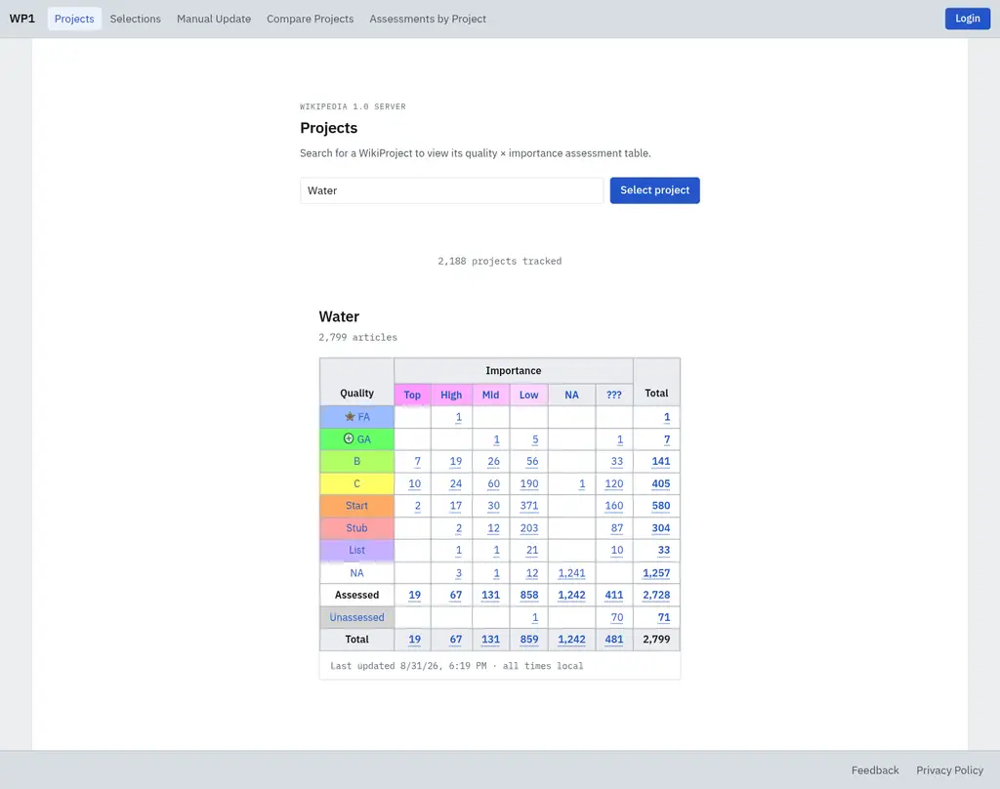

# WP1 — the Wikipedia 1.0 engine

[](https://github.com/openzim/wp1/actions?query=branch%3Amain)
[](https://codecov.io/gh/openzim/wp1)
[](https://www.codefactor.io/repository/github/openzim/wp1)
[](https://wp1.readthedocs.io/en/latest/?badge=latest)
[](https://www.gnu.org/licenses/old-licenses/gpl-2.0.en.html)

WP1 is the software behind [wp1.openzim.org](https://wp1.openzim.org), the
successor to the original bot of the
[Wikipedia 1.0 project](https://en.wikipedia.org/wiki/Wikipedia:Version_1.0_Editorial_Team)
— which, as [User:WP 1.0 bot](https://en.wikipedia.org/wiki/User:WP_1.0_bot),
has more all-time edits than any other account on English Wikipedia. It:

- Aggregates the **quality and importance assessments** of every rated English
  Wikipedia article, across more than 2,000
  [WikiProjects](https://en.wikipedia.org/wiki/Wikipedia:WikiProject), into
  browsable quality × importance tables, with nightly updates posted back
  on-wiki as [project tables](https://en.wikipedia.org/wiki/User:WP_1.0_bot/Tables/Project/Catholicism)
  and change logs.
- Lets users build **selections** — custom article lists defined by
  WikiProject, [Petscan](https://petscan.wmcloud.org/),
  [SPARQL](https://query.wikidata.org/), combinations thereof, or plain lists
  — for slicing Wikipedia content.
- Turns those selections into **[ZIM files](https://wiki.openzim.org/wiki/ZIM_file_format)**,
  via the [Zimfarm](https://github.com/openzim/zimfarm), for reading offline
  with [Kiwix](https://kiwix.org/).



End-user documentation lives at
[wp1.readthedocs.io](https://wp1.readthedocs.io/en/latest/); the API is
described by [openapi.yml](openapi.yml) and browsable at
[api.wp1.openzim.org](https://api.wp1.openzim.org).

## Quick start (development)

Everything runs in Docker: the only hard requirement is
[Docker](https://www.docker.com/) with the compose plugin. From a fresh
checkout:

```bash
docker compose -f docker-compose-dev.yml up --build
```

This starts the full development stack — frontend with hot reload at
http://localhost:5173, API server at http://localhost:5000, plus the dev
database (MariaDB), Redis, materializer workers, and MinIO (s3-compatible
storage). No configuration is needed: the defaults in `wp1/config.py` already
point at these services.

On the first run (and after new migrations land), migrate the dev database as
described in [docker/dev-db/README.md](docker/dev-db/README.md), which also
covers seeding it with test Selection data. Migrations, like the rest of the
host-side Python toolchain, run through
[Pipenv](https://pipenv.pypa.io/en/latest/):

```bash
pip3 install pipenv       # into your global Python (3.12), not a virtualenv
pipenv install --dev
```

That's it. Edits to `wp1-frontend/src/` hot-reload in the browser, and the
source tree is volume-mounted into the API container, where Flask's debug
mode auto-reloads on backend edits. Development is targeted at Linux; other
platforms may not be fully supported.

## Repository tour

| Path                                      | What it is                                                                                                                                                       |
| ----------------------------------------- | ---------------------------------------------------------------------------------------------------------------------------------------------------------------- |
| [`wp1/`](wp1/)                            | The Python backend: `wp1/logic` (business logic), `wp1/web` (Flask API), RQ jobs, and the update engine. Runs only inside the Docker images.                     |
| [`wp1-frontend/`](wp1-frontend/README.md) | The Vue 3 + Vite + Tailwind frontend.                                                                                                                            |
| [`docker/`](docker/README.md)             | One subdirectory per Docker image (production and dev), including the local [Zimfarm](docker/zimfarm/README.md) and the [dev database](docker/dev-db/README.md). |
| [`db/`](db/README.md)                     | YoYo database migrations for the `enwp10` database.                                                                                                              |
| [`scripts/util/`](scripts/util/README.md) | Development helpers: test runner, type checker, dev-data seeder, parallel worktree stacks.                                                                       |
| [`scripts/wp1/`](scripts/wp1/README.md)   | Production deploy, rollback, and operational scripts.                                                                                                            |
| [`docs/`](docs/)                          | The [mkdocs](https://www.mkdocs.org/) sources for [wp1.readthedocs.io](https://wp1.readthedocs.io/en/latest/).                                                   |
| [`cron_config.py`](cron_config.py)        | The recurring production jobs (nightly update enqueues, table rebuilds, cache warming), scheduled by RQ's cron scheduler.                                        |

## Development

### Configuration (.env)

All backend configuration lives in a single schema in `wp1/config.py`, read
from environment variables. The committed [`.env.example`](.env.example) is
**generated from that schema** (run `pipenv run python -m wp1.config` after
changing it; CI fails on drift) and documents every knob, its type, its
default, and whether it is required in production.

For development you usually need no configuration at all: the schema defaults
point at the services in `docker-compose-dev.yml`. To customize values, copy
`.env.example` to `.env` (gitignored) and edit it; the dev containers pick it
up via docker compose's `env_file`.

The main thing worth customizing is the `WIKIDB` section: the app reads the
enwiki_p replica database (referred to in the code as `wikidb`) on Toolforge,
and needs your Toolforge credentials to do so. If you are a part of the
toolforge `enwp10` [project](https://tools.wmflabs.org/admin/tool/enwp10), you
can find the credentials on toolforge in the replica.my.cnf file in the tool's
home directory. This is not required for developing the frontend.

The production instance additionally requires English Wikipedia API
credentials (`API_USER`/`API_PASSWORD`) for editing on-wiki tables; in
development (`WP1_ENV=development`, the default) the jobs that edit Wikipedia
are disabled.

### Backend tests

The Python tests need the test databases from `docker-compose-test.yml`; the
wrapper script starts them automatically (and cleans up after interrupted
runs):

```bash
./scripts/util/run_tests.sh
```

(or plain `pipenv run pytest` if the test containers are already up). No
`.env` is needed: the pytest bootstrap (`conftest.py`) constructs the test
configuration in code.

### Frontend tests

The Cypress suite is hermetic — every API call is stubbed, so no backend or
Docker services are needed, just the frontend served on port 5173:

```bash
cd wp1-frontend
pnpm dev                  # or: pnpm build --mode staging && python3 -m http.server 5173 --directory dist/
pnpm exec cypress run     # in another terminal; `cypress open` for the GUI
```

See [wp1-frontend/README.md](wp1-frontend/README.md) for more on the frontend,
including running it outside Docker.

### Going further

- **ZIM file creation** — run a complete local Zimfarm with the `zimfarm` and
  `zimfarm-worker` compose profiles: see
  [docker/zimfarm/README.md](docker/zimfarm/README.md).
- **Parallel dev stacks** — every port and container name is parameterized,
  so multiple checkouts/worktrees can run side by side:
  `./scripts/util/create_worktree.sh <branch>`, documented in
  [scripts/util/README.md](scripts/util/README.md).
- **Manual update endpoints** — in development some project endpoints are
  overlaid with fakes for easier frontend work: see
  [wp1/web/dev/README.md](wp1/web/dev/README.md).
- **Editing the docs** — the Read the Docs site rebuilds from `docs/` on
  every push to `main`, and CI runs `mkdocs build --strict` on every PR. To
  preview locally: install `docs/requirements.txt` into a virtualenv, then run
  `mkdocs serve` from the repository root.

## Production

Deploys are done with `./scripts/wp1/deploy.sh`, which pushes `main` to the
`release` branch (triggering the image builds on CI) and then updates the
production box. Rollbacks, one-off operational scripts, SSH access to the box,
and the Redis persistence rules are all documented in
[scripts/wp1/README.md](scripts/wp1/README.md).

## Contributing

See [CONTRIBUTING.md](CONTRIBUTING.md) for code standards, testing
requirements, and PR guidelines. Before your first commit, install the
[pre-commit](https://pre-commit.com/) hooks that keep the code formatted:

```bash
pipenv run pre-commit install
```

(Details in the comments of [.pre-commit-config.yaml](.pre-commit-config.yaml).)

## License

GPLv2 or later, see [LICENSE](LICENSE) for more details.
