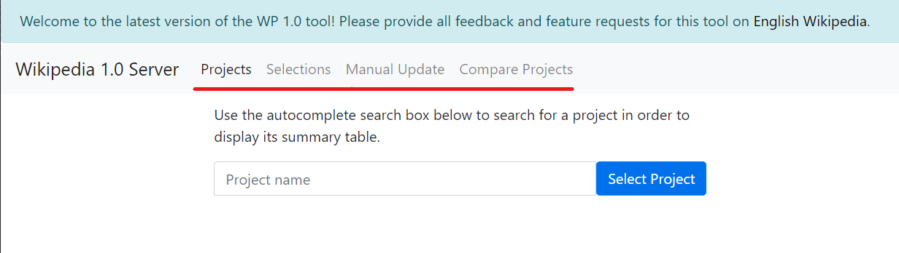

# End User Documentation

This section contains the end user documentation for the WP 1.0 Engine. It
provides guidance on how to use the tools located at
[wp1.openzim.org](https://wp1.openzim.org). There is also [developer
documentation](../developer) available, for how to develop and contribute to the
underlying software for the tools.

Discussion of the WP 1.0 tool, including feature requests, bug reports, or
requests for technical help, should happen on [English Wikipedia talk
pages](https://en.wikipedia.org/wiki/Wikipedia_talk:Version_1.0_Editorial_Team/Index).

[TOC]

# Logging in

Some operations on the site, such as creating selections and manually updating
projects, require you to be logged in. You don't need to create an account,
however, even if you've never logged into WP 1.0 before. The site uses OAuth to
allow you to log in to WP 1.0 with your Wikipedia username and password. Your
credentials are handled entirely by the main Wikipedia site and are never seen
by the WP 1.0 tool. Only the authentication information is shared.

Begin the login process by clicking any of the "Login" buttons throughout the
site.

# Main navigation links

At the top of the WP 1.0 [website](https://wp1.openzim.org), there are various
navigation links. Here is a brief description of the page that each one leads
to, with links to more documentation.

## Projects

A listing of every WikiProject tracked in the WP 1.0 index. Type in the project
name, which will be auto-completed, and select from the drop-down list in order
to select a project

## Selections

View or create your own [content selections](/user/selections). A content
selection is a list of articles that can be used by other tools to, for example,
create an offline version of Wikipedia.

## Manual Update

For a given WP 1.0 **Project**, a logged in user can request a manual update of
the ratings for that project. This is contrast to a _scheduled_ update, which
happens once per day.

## Compare projects

This page allows you to select multiple projects and compare the ratings each
article has across each project. For example, you can select "Philosophy" and
"Modern Philosophy" and see what the relative ratings are for each project and
how they maybe differ.
