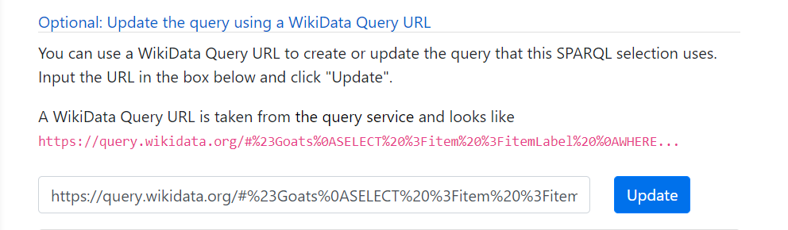

# Selections

Selections are _named lists of articles in a specific Wikimedia project_.
Selections are created and managed by a logged in user to the WP 1.0
[website](https://wp1.openzim.org).

[TOC]

# Getting to the Selections page

The selections page can be found by using the main navigation on every page of
the site. Simply click on "Selections".


Once you're there, you will see the Selections **sub-navigation** which contains
options for:


1. My Selections: Viewing your own selections (this will be empty when you first
   start out)
1. Simple Selection: Creating or editing a [Simple
   Selection](/user/selections/#simple-selection)
1. SPARQL Selection: Creating or editing a [SPARQL
   Selection](<(/user/selections/#sparql-selection)>)

# Simple Selection

## Creating a Simple Selection

If you've never created a selection before and you're interested in how they
work, the best thing to do is to create a **Simple Selection**.

In a Simple Selection, the article list that represents the finished collection
is the same as the list you specify when creating it. So, you might create a
Simple Selection with three items: 'Statue_of_Liberty', 'Eiffel Tower', and
'Gateway_of_India'. The final output of the selection is the same list.

Let's see that in action. Go to the Selections link in the main navigation, then
choose 'Simple Selection'. You will be presented with an empty form to fill out
to create your selection.


1. The first form item is the Wikimedia project that this selection applies to.
   If you're creating a selection of a list of articles on English Wikipedia,
   you can leave this as the default, _en.wikipedia.org_. If, on the other hand,
   your articles exist on French Wikipedia, you should select
   _fr.wikipedia.org_. Follow the same process for whichever project you wish to
   use.
2. The second item is the name of your list. It is required. This can be
   anything you want and is primarily used to allow you to identify your
   selection later, when you have many of them.
3. The biggest form input is for the articles that comprise your selection. This
   is where you will enter your articles, without any leading URL information
   prepended to them. So for example, if you wish to include the article for
   _Gateway of India_, which is located at
   https://en.wikipedia.org/wiki/Gateway_of_India, you will type simply
   `Gateway_of_India`. The underscores are preferred, but if you forget and type
   spaces, the tool will correct it for you. As noted in the default value of
   the form field, whitespace (spaces, tabs, newlines) and comments starting
   with \*#\_ are ignored. You can use those characters to group your articles
   together.
4. Once you have entered this information, click _Save List_ to save your
   selection. You will be notified if there are any problems you need to
   correct.

Once you've saved your selection/list, you will be returned to the "My
Selections" tab, where you should see an entry for your newly created selection.

# Selection lifecycle

The final output of a selection is a **.tsv** file containing the articles in
the selection. As mentioned before, for Simple Selections, this TSV file
contains the same content as the list you input (except with space normalized to
underscores and comments and extraneous whitespace removed).

The WP 1.0 tool must generate or **materialize** the final list from the input
you provided. In the case of a Simple Selection this is, well, simple, but still
takes a few seconds. While the list is being materialized, a status indicator
(spinner) is shown in place of the download link. Once materialization is
finished, you will be provided with a link to download the final TSV.

This process is the same for SPARQL selections, or for any selection types that
might exist in the future. First you must create the selection, then it gets
processed/materialized, and finally you can download the output in TSV or (in
the future) some other format.

# SPARQL Selection

## Creating a SPARQL selection.

A SPARQL selection is a selection where you specify a [SPARQL
query](https://www.wikidata.org/wiki/Wikidata:SPARQL_tutorial/en) that is
intended to be run against the [Wikidata Query
Service](https://query.wikidata.org/). The output of the query becomes the TSV
list you end up downloading.

SPARQL queries are powerful, because we can specify lists that sit at the
intersection of different concepts. For example, we might want to know all the
Wikipedia articles for artworks that live in museums in Rome. But maybe then we
can expand our query to artworks the live in Rome or Paris. Or artworks that
live in any global capital city, or only ones that were created in the 18th
century, etc.

If you've already created a Simple Selection above, great! The steps to creating
a SPARQL selection are largely the same. There are two main differences:

1. Instead of specifying a literal list of articles, we provide a query in the
   SPARQL query language.
2. The output TSV is a list of articles that meet the criteria of the query, not
   the actual query itself. This is in contrast to Simple Selections, where the
   output list is essentially the same as the input list.

## Input your query

Use the [secondary navigation](http://localhost:8000/user/selections/#getting-to-the-selections-page) under "Selections" to choose "SPARQL Selection". You should see the following form:


1. The first item is the Wikimedia project this query applies to. In general this, works the same as for Simple selections, except that for SPARQL, the project URL must appear in the query. We'll discuss that more below.
2. Next is the name of the selection, which works exactly the same as Simple selections.
3. For SPARQL selections, you can click the "Option: Update the query using a WikiData Query URL" link to expand that section. Then, you will be able to populate your query field using a URL taken from the [WikiData Query Service](https://query.wikidata.org/). For example, suppose you have this URL: `https://query.wikidata.org/#%23Goats%0ASELECT%20%3Fitem%20%3FitemLabel%20%0AWHERE%20%0A%7B%0A%20%20%3Fitem%20wdt%3AP31%20wd%3AQ2934.%0A%20%20SERVICE%20wikibase%3Alabel%20%7B%20bd%3AserviceParam%20wikibase%3Alanguage%20%22%5BAUTO_LANGUAGE%5D%2Cen%22.%20%7D%0A%7D`.
   1. Click on the "Optional..." link, and the input is revealed:
      
   2. If you then paste in the URL given above and click "Update", the query embedded in that URL (about "Goats") will appear in the Query field
4. In the actual Query field, you can type your own query, or paste it in from somewhere. You can also use a query from WikiData Query Service that you have a link to buy using the inputs in option (3) above.
5. Finally, you can click "Save list" to save your selection. This will cause it to be immediately sent to the WikiData Query Service to be processed.

## Selecting URLs in your query

In order to work as a WP 1.0 Selection, **SPARQL queries must select an article URL as part of the query**. While it is possible that the query you may have been provided already has this selection (we have seen some examples that do), you may have to add this manually.

If you look at sample WikiData Query Service queries, such as "Goats":

```sparql
#Goats
SELECT ?item ?itemLabel
WHERE
{
  ?item wdt:P31 wd:Q2934.
  SERVICE wikibase:label { bd:serviceParam wikibase:language "[AUTO_LANGUAGE],en". }
}
```

And "Rock Bands that start with 'M'":

```sparql
#Rock bands that start with "M"
SELECT ?band ?bandLabel
WHERE
{
  ?band wdt:P31 wd:Q5741069 .
  ?band rdfs:label ?bandLabel .
  FILTER(LANG(?bandLabel) = "en") .
  FILTER(STRSTARTS(?bandLabel, 'M')) .
}
```

You'll see that they are selecting an `?item` (or `?band`) and a label for that thing. This works great when querying WDQS in general, because we get the "Entity" that is the result of the query, along with it's label, which is the plain English representation of what that thing is.

However, when we query in WP 1.0, **we need to also retrieve the entity's URL**, which contains the article ID for the project that is being queried. So while the rock bands query will return as it's first result the following:

```text
wd:Q674305	Make-Up
```

We also need the URL of that band on whatever Wikimedia project we wish to query. This could be English Wikipedia, `en.wikipedia.org` or perhaps French Wikipedia, `fr.wikipedia.org` -- whatever we selected from the drop down in step 1 above.

To do this, we add additional triples to the query, and an additional query variable to the SELECT clause:

```sparql
#Rock bands that start with "M"
SELECT ?band ?bandLabel ?article
WHERE
{
  ?band wdt:P31 wd:Q5741069 .
  ?band rdfs:label ?bandLabel .

  { ?article schema:about ?band. ?article schema:isPartOf <https://en.wikipedia.org/>. }

  FILTER(LANG(?bandLabel) = "en") .
  FILTER(STRSTARTS(?bandLabel, 'M')) .
}
```

And we wind up with:

```text
wd:Q674305	Make-Up	<https://en.wikipedia.org/wiki/Make-Up_(Japanese_band)>
```

Note that it's important that that URL in the `schema:isPartOf` triple (in this case `https://en.wikipedia.org/`) matches the project that was selected in the drop down for the

### What if I get an error about 'Did not find any articles in query results'?

Sometimes, you might end up with this error message, along with a "PERMANENTLY FAILED" status for your selection:


It reads:

```text
Did not find any articles in query results. Make sure you are selecting
a ?url in your query using the "schema:about" predicate, and that you are
using the schema:isPartOf predicate to limit your URLs to a project that
matches the project you selected on the Selection edit screen.
```

This means that WP 1.0 could not find any articles listed in your query results. Make sure your query meets all of the following criteria:

1. There are `schema:about` and `schema:isPartOf` triples that refer to the project you're selecting articles from.
2. The SELECT clause of your query selects the query variable that is the subject of those triples. So, if your triple is `?article schema:about ?band`, in this case `?band` is the entity you are selecting (bands that start with 'M') and `?article` is the subject of the `schema:about` triple. You need to make sure that the select clause contains that query variable: `SELECT ?band ?bandLabel` does not meet this criteria, while `SELECT ?band ?bandLabel ?article` works.
3. The URL in the object of your `schema:isPartOf` triple matches the Wikimedia project in the drop down of your selection. So if your selection is for French Wikipedia (`fr.wikipedia.org`), you should have `?article schema:isPartOf <https://fr.wikipedia.org/>` not `?article schema:isPartOf <https://en.wikipedia.org/>`
