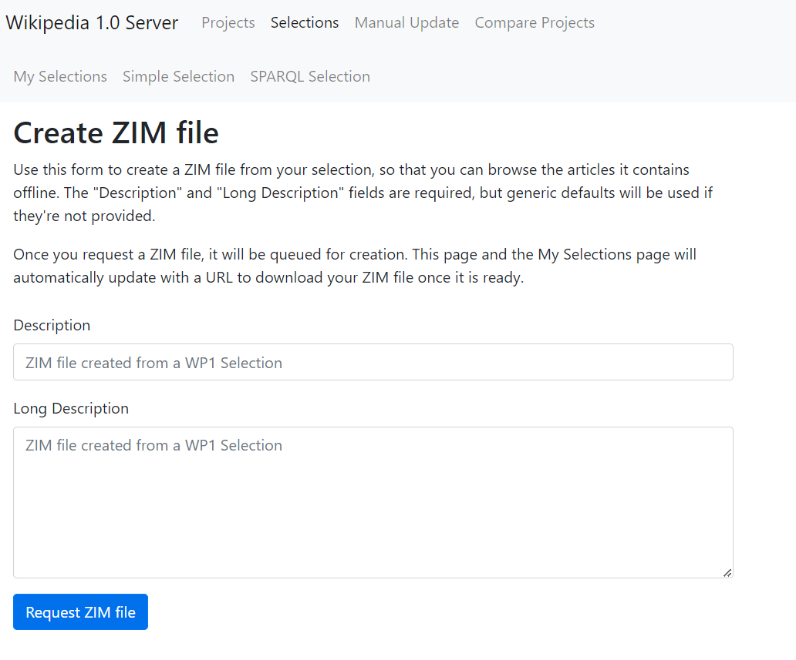
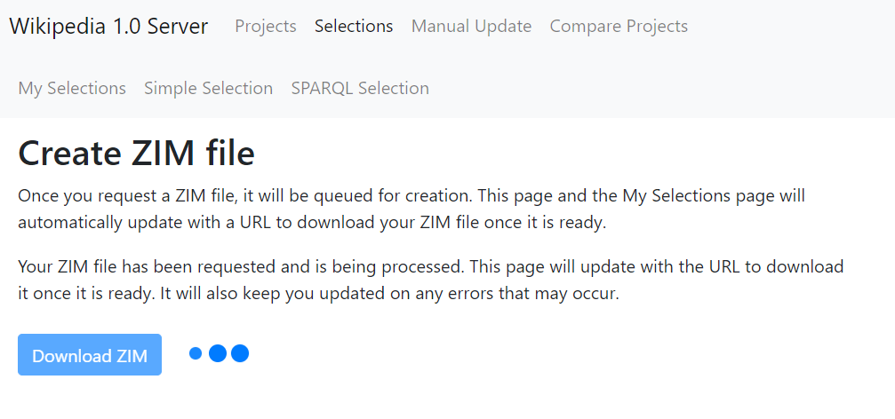
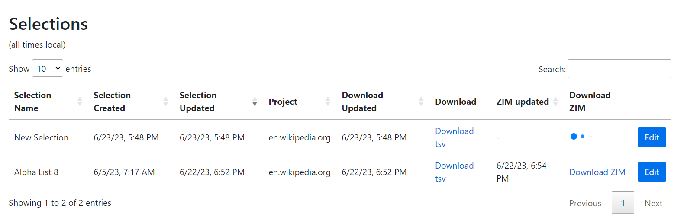
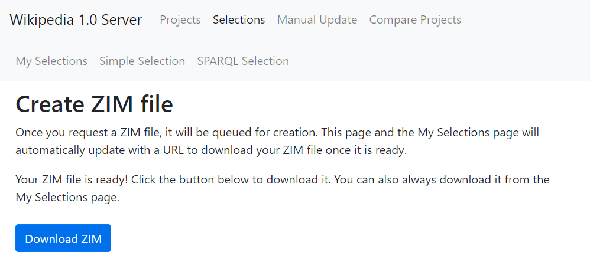
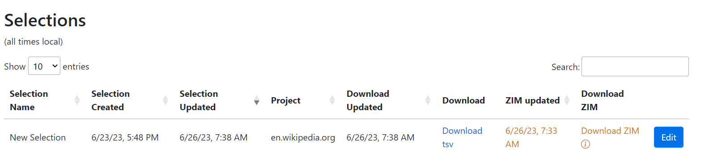

# ZIM Files

A ZIM file is _an archive of wiki or other web page content for offline usage_.
You can read more about ZIM files on the [OpenZIM website](https://wiki.openzim.org/wiki/OpenZIM). Generally speaking, users of the WP1 site will create ZIM files from their [Selections](selections.md) in order to browse the articles that were selected, offline, using a [ZIM reader](https://wiki.openzim.org/wiki/Readers)

[TOC]

# Creating a ZIM file from a WP1 Selection

In order to create a ZIM file, you must first have a [Selection](selections.md) that has been **materialized**. Your Selection has been materialized when a "Download TSV" link appears in its row on the Selections page. After that, you can click the link to "Create ZIM" to begin the process of creating a ZIM file.

Notice that in this screenshot, the ZIM file for "Alpha List 8" has already been created and is available for download.

By clicking the "Create ZIM" button, we are taken to the ZIM creation screen.

Here, we can fill out the Description (required) and Long Description of our ZIM file, and request for it to be created. Like Selection materialization, ZIM file creation is performed as a background task because it requires coordination with remote servers and APIs. When you click "Request ZIM file", the screen will change to the following:

This page is "live", in the sense that it actively tracks the status of your ZIM and will update once it's ready. The Selections page also tracks the availability of the ZIM file and shows a loading spinner:

Back on the ZIM file creation screen, when your ZIM is ready to download you will see the spinner disappear, replaced by a message that your ZIM is ready and a download button. The download link will also appear on the Selections page at this time.

# ZIM updates

## Automatic ZIM Updates

If you edit your Selection, then it's possible (and quite likely) that the materialized list of articles will change. This means that your ZIM file will be out of date. In the Selections view, it will show up in orange text, with a message explaining that it is out of date.

When this happens, the WP1 app knows to automatically re-request a ZIM file for you. This has happened in the background when your Selection was updated. The Selections page is "live" and will update with the new ZIM link once it's available.

## Outdated/Deleted ZIMs

ZIM files are **only available for download for 2 weeks**. After that period, they are deleted from the system. When that happens, the "Download ZIM" link on the Selections page will change back to a "Create ZIM" button, and you will have to re-request your ZIM from the beginning.
